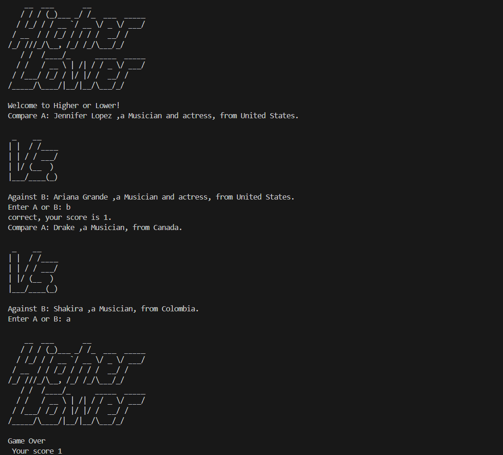

# Higher or Lower
🎉 A guessing game built in Python where the user guesses whether a celebrity has more or fewer followers than another. 🌟

## 🎮 How to Play
👉 Download the `main.py`, `game_data.py`, and `art.py` files, then execute the `main.py` script. 🖥️ Have fun guessing! 🙌

## 📸 Screenshots

## 🙏 Credits
This project is part of my journey through Angela Yu's *100 Days of Code: The Complete Python Bootcamp*. While the idea originates from the course, the code logic has been written entirely by me. 

Thank you.
